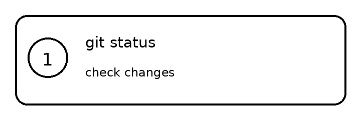

# main-project
Git講座用 mainプロジェクト

### Overview

### Basic Git workflow
1. `git status`
2. `git add .`
3. `git commit -m "practice"`

## Usage

1. Clone this repository.
2. Initialize the submodule.
3. Update the submodule when needed.
